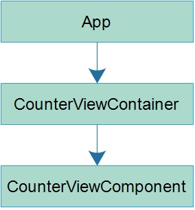
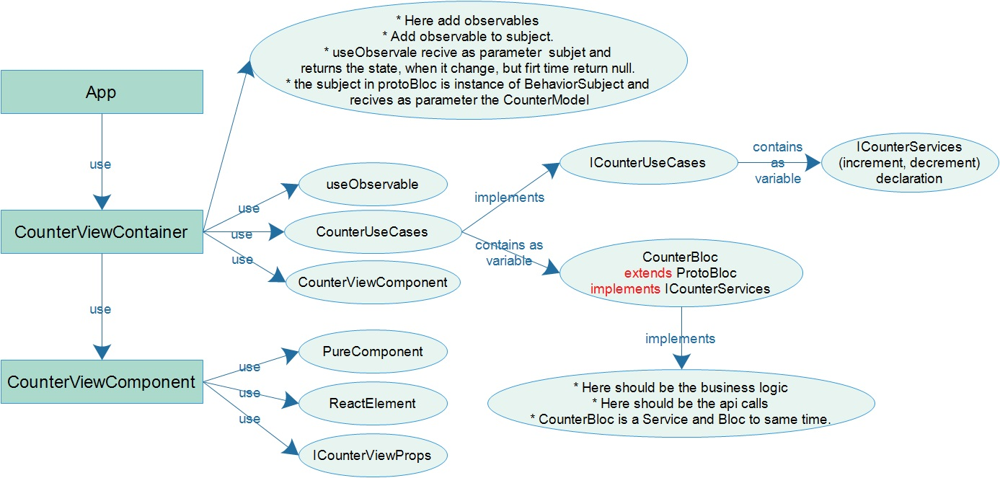
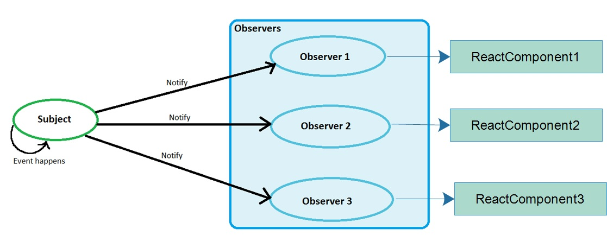

# Examples

1. npm start

2. Local:            http://localhost:3000

3. On Your Network:  http://192.168.0.100:3000

4. node v14.17.1

5. npm 6.14.13

# Diagrams

### high level architecture

  

### medium level architecture

  

### ObserverPattern

Each component can observe any state

  

