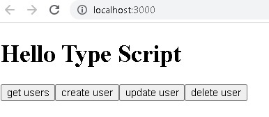
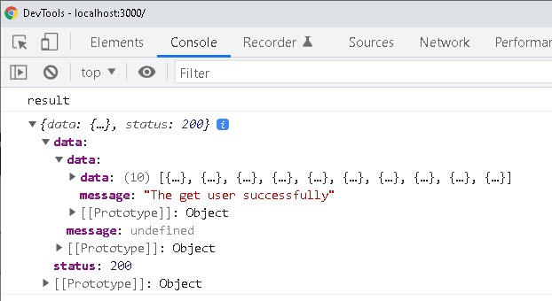
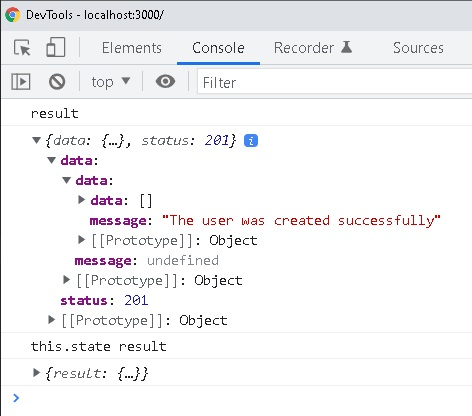
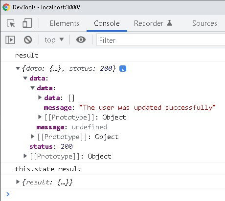
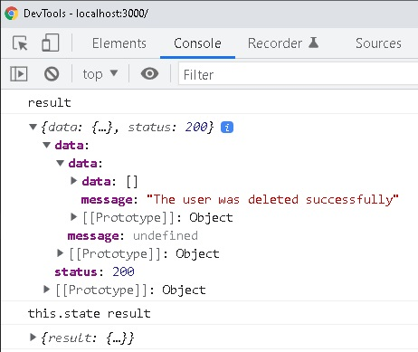

# Examples

it was generated with: npx example-type-script --template typescript

1. npm start

2. Local:            http://localhost:3000

3. On Your Network:  http://192.168.0.100:3000

node v14.17.1

npm 6.14.13

# Screens

#### UI

  

#### result-get

  

#### result-post

  

#### result-put

  

#### result-delete

  

